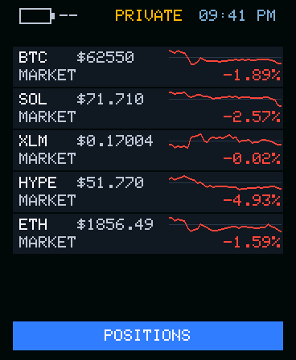
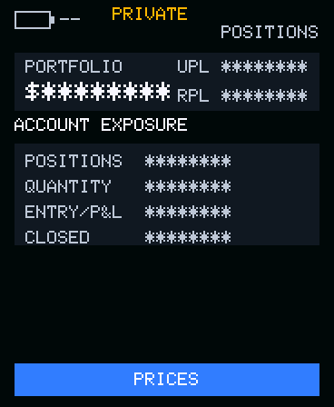
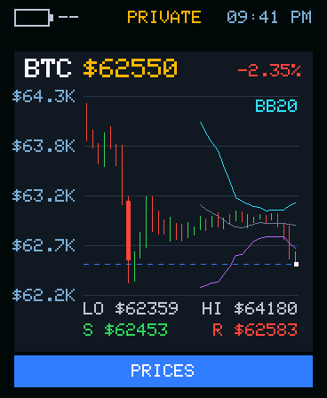
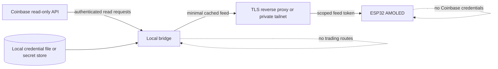

# Coinbase AMOLED Terminal

An unofficial, read-only Coinbase portfolio and market display for the Waveshare
ESP32-S3 Touch AMOLED 1.8.

> [!IMPORTANT]
> This independent project is **not affiliated with, endorsed by, or sponsored by
> Coinbase**. Coinbase and related marks belong to their respective owners. This
> software is not financial advice and must not be used as a substitute for the
> official Coinbase interfaces.

## Step 1

Run this one line on macOS or mainstream Linux:

```bash
curl -fsSL https://raw.githubusercontent.com/Homard-Simpson/coinbase-amoled-terminal/main/install.sh | bash
```

## Step 2

At the hidden prompt, paste the Coinbase CDP **ECDSA** API key JSON you downloaded
from Coinbase, or drag that JSON file into the terminal, then press **Enter**.
Use a dedicated key with **view permission only**. The setup refuses keys that can
trade or transfer.

### What the installer does

- Clones application source only from this exact repository's `main` branch into
  your standard per-user data folder, creates an isolated Python environment, and
  installs the bridge plus its declared `cryptography` dependency from official
  PyPI. Docker and administrator access are not used.
- Stores only the CDP key name and P-256 private PEM in atomic mode-0600 files. It
  never prints the key or passes it in command arguments, environment variables,
  or service files.
- Checks Coinbase's live `/key_permissions` endpoint, creates a separate display
  ID/token, starts a launchd or systemd user service, and runs `doctor`. If user
  services are unavailable, it prints a safe foreground command instead.
- Listens on port 8788 for the authenticated display feed. Use it only on a
  trusted LAN, or put private HTTPS/tailnet ingress in front as described below.

This two-step flow expects the **preflashed hardware package** and its pairing
screen. If you are building or flashing the source firmware, use
[Advanced source/developer setup](#advanced-sourcedeveloper-setup) below.

Safe sample mode (no Coinbase account or credential):

```bash
curl -fsSL https://raw.githubusercontent.com/Homard-Simpson/coinbase-amoled-terminal/main/install.sh | bash -s -- --sample
```

Uninstall the app and service while keeping private setup data:

```bash
curl -fsSL https://raw.githubusercontent.com/Homard-Simpson/coinbase-amoled-terminal/main/install.sh | bash -s -- --uninstall
```

Add `--purge` after `--uninstall` only when you also want to delete local
credentials, configuration, and device tokens.

## Actual interface

These are direct 368 × 448 framebuffer captures from the production firmware
renderer using current public market data. They are not concepts or hand-designed
mockups. Account fields are hidden by the renderer's privacy mode.

### Live prices



Five public markets with live prices, short-window direction, and tap targets for
expanded charts.

### Positions in privacy mode



The actual account page with portfolio, position, quantity, entry, P&L, and
closed-position fields obfuscated before framebuffer output.

### BTC candles, BB20, and key levels



Real hourly BTC-USD candles with volume-weighted body widths, BB20 upper/lower and
middle bands, live-price marker, and public-data support/resistance levels.

See [capture provenance](docs/INTERFACE_CAPTURE.md) for renderer source hashes,
raw framebuffer checksums, the immutable public-data snapshot, and reproduction
steps.

## Status

This is a public, pre-1.0 open-source release. Interfaces, provisioning steps,
and firmware behavior may change, and there are no stable releases yet. The
security-first defaults and read-only trading boundary remain release
requirements, not optional examples.

## Sustainable project model

The open-source licenses permit personal and commercial use, modification,
hosting, support, and resale when their terms are followed. Compliant commercial
resale owes the project no royalty. Buying hardware or support is not required to
use the source.

The maintainers may separately offer official preassembled or preflashed
hardware, integration, updates, and support. They may also offer a paid
proprietary exception for closed-source use. Those optional offerings fund
maintenance; they do not remove the open-source option or imply Coinbase
endorsement. See [commercial licensing](COMMERCIAL-LICENSING.md).

## What it does

- Shows selected public market prices, compact history, and read-only portfolio
  data on a 368 × 448 AMOLED display.
- Supports the Waveshare ESP32-S3 Touch AMOLED 1.8 V1 and V2 hardware revisions.
- Keeps Coinbase API credentials on a bridge you control.
- Gives the display only a separate, scoped device-feed token.
- Supports local-network or private-tailnet deployments by default.
- Builds both hardware variants in CI with non-production placeholder settings.

## What it deliberately does not do

- Place, edit, cancel, or simulate orders.
- Expose trading or order-management endpoints.
- Store Coinbase API credentials on the ESP32.
- Provide a hosted relay, telemetry service, analytics, or cloud account.
- Promise portfolio accuracy, uptime, execution safety, or investment outcomes.

## Security model in one minute



The bridge is the only component that can read Coinbase credentials. The device
receives a minimized display payload through a read-only feed route. Bind the
bridge to loopback, expose it only through a private tailnet or an authenticated
TLS reverse proxy, and use a Coinbase key restricted to view-only permissions.

See [Architecture](docs/ARCHITECTURE.md) and
[Threat model](docs/THREAT_MODEL.md) for the full trust-boundary analysis.

## Hardware support

| Board | Display | Touch | Build variant | Status |
| --- | --- | --- | --- | --- |
| Waveshare ESP32-S3 Touch AMOLED 1.8 V1 | SH8601 | FT5x06 family | `v1` | Supported |
| Waveshare ESP32-S3 Touch AMOLED 1.8 V2 | CO5300 | CST816S/CST820 family | `v2` | Supported |

Board revisions are not electrically interchangeable. In particular, V2 must not
receive V1-specific PMU initialization writes. Confirm the revision before
flashing. Details: [Hardware compatibility](docs/HARDWARE_COMPATIBILITY.md).

## Repository layout

```text
install.sh  Two-step per-user installer entry point
installer/  Fixed launchd/systemd templates and safe renderer
bridge/     Local read-only feed service; owns Coinbase credentials
firmware/   ESP-IDF application for V1 and V2 boards
docs/       Architecture, setup, security, and release documentation
scripts/    Public-safety checks, CI helpers, and the one-command preflight
tests/      Repository, installer, and scanner tests
.github/    CI, dependency updates, and contribution templates
```

## Documentation

- [Setup overview](docs/SETUP.md)
- [Architecture](docs/ARCHITECTURE.md)
- [Threat model](docs/THREAT_MODEL.md)
- [Hardware compatibility](docs/HARDWARE_COMPATIBILITY.md)
- [Troubleshooting](docs/TROUBLESHOOTING.md)
- [Security policy](SECURITY.md) and [privacy notes](PRIVACY.md)
- [Release checklist](docs/RELEASE_CHECKLIST.md)
- [Public-release checklist](docs/PUBLIC_RELEASE_CHECKLIST.md)
- [Interface capture provenance](docs/INTERFACE_CAPTURE.md)
- [Branch protection status](docs/BRANCH_PROTECTION.md)
- [Licensing scope](LICENSING.md) and [commercial licensing](COMMERCIAL-LICENSING.md)
- [Contributor License Agreement](CONTRIBUTOR_LICENSE_AGREEMENT.md)
- [Trademark policy](TRADEMARKS.md)

## Advanced source/developer setup

Use this section when building firmware from source, developing the bridge, or
configuring private HTTPS/tailnet ingress manually.

### 1. Review the boundaries

Read [SECURITY.md](SECURITY.md), [PRIVACY.md](PRIVACY.md), and the
[setup overview](docs/SETUP.md). Create a Coinbase credential with read-only/view
permissions; never enable transfer or trading permissions for this project.

### 2. Prepare local development tools

Requirements:

- Python 3.11 or newer
- ESP-IDF 5.5.x for firmware builds
- Docker Compose v2 (optional, for the bridge)
- ShellCheck, markdownlint-cli2, and actionlint (recommended for full preflight)

```bash
python3 -m venv .venv
. .venv/bin/activate
python -m pip install -r requirements-dev.txt
```

### 3. Configure placeholders, then secrets

```bash
cp .env.example .env
mkdir -m 700 secrets
```

`.env` contains only non-secret runtime settings. Put credentials and the device
feed token in separate files under `secrets/`; that directory is ignored by Git.
The exact file formats and least-privilege guidance are in
[docs/SETUP.md](docs/SETUP.md). Do not paste secrets into Compose files, firmware
headers, issue reports, logs, or screenshots.

### 4. Run the local bridge

```bash
docker compose up --build
```

The provided Compose configuration publishes the bridge on loopback only. It is a
development baseline, not a public-internet deployment. Add a TLS reverse proxy
or private tailnet before connecting a remote display.

### 5. Build the correct firmware variant

With ESP-IDF exported in the current shell:

```bash
./scripts/build-firmware.sh v1
# or
./scripts/build-firmware.sh v2
```

No secrets are compiled in. The device is onboarded at runtime through its
captive portal, where you enter Wi-Fi, the bridge feed URL, the device ID, and
the per-device bearer token; all are stored in NVS. CI builds both variants as
compile proofs only; do not flash CI artifacts as configured releases.

### 6. Run the complete preflight

```bash
./scripts/preflight.sh
```

This scans publishable text for secrets and personal infrastructure, validates
shell and Python sources, runs lint/tests when installed, checks Compose when
available, and checks Git whitespace. Binary files and image pixels/metadata still
require manual review. Use `PREFLIGHT_STRICT_TOOLS=1` to require every optional
tool.

## Common commands

```bash
make help
make scan
make lint
make test
make markdown
make workflow-lint
make preflight
make firmware-v1
make firmware-v2
make compose-check
```

## Deployment defaults

1. Keep the bridge on the same trusted LAN as the display, or on a private
   tailnet.
2. Bind the bridge to loopback and publish it through a TLS reverse proxy when it
   crosses a host boundary.
3. Require a unique, rotatable feed token for every device.
4. Return only fields required by the UI; avoid raw account responses.
5. Disable request-body and authorization-header logging.
6. Keep all order and trading functionality out of the bridge.

## Contributing

Read [CONTRIBUTING.md](CONTRIBUTING.md), the
[Contributor License Agreement](CONTRIBUTOR_LICENSE_AGREEMENT.md), and the
[Code of Conduct](CODE_OF_CONDUCT.md). Security vulnerabilities belong in a
private GitHub security report, not a public issue; see [SECURITY.md](SECURITY.md).

Before opening a pull request, run:

```bash
./scripts/preflight.sh
```

## Licensing and trademarks

Original root and bridge software is available under
[GNU AGPL-3.0-or-later](LICENSE). Original firmware software is available under
[GNU GPL-3.0-or-later](firmware/LICENSE). Third-party components and assets retain
their upstream terms.

No original hardware/CAD/source-design files are currently included. Future
original hardware design files are intended to use CERN-OHL-S-2.0 unless a
file-level notice says otherwise; third-party Waveshare designs and documentation
will not be relicensed.

Paid proprietary exceptions may be available for closed-source use, but
AGPL/GPL-compliant commercial use and resale remain royalty-free. See
[licensing scope](LICENSING.md), [commercial licensing](COMMERCIAL-LICENSING.md),
[NOTICE](NOTICE), and the [trademark policy](TRADEMARKS.md). These license choices
and the contributor agreement should be reviewed by qualified counsel before
material commercial reliance.
