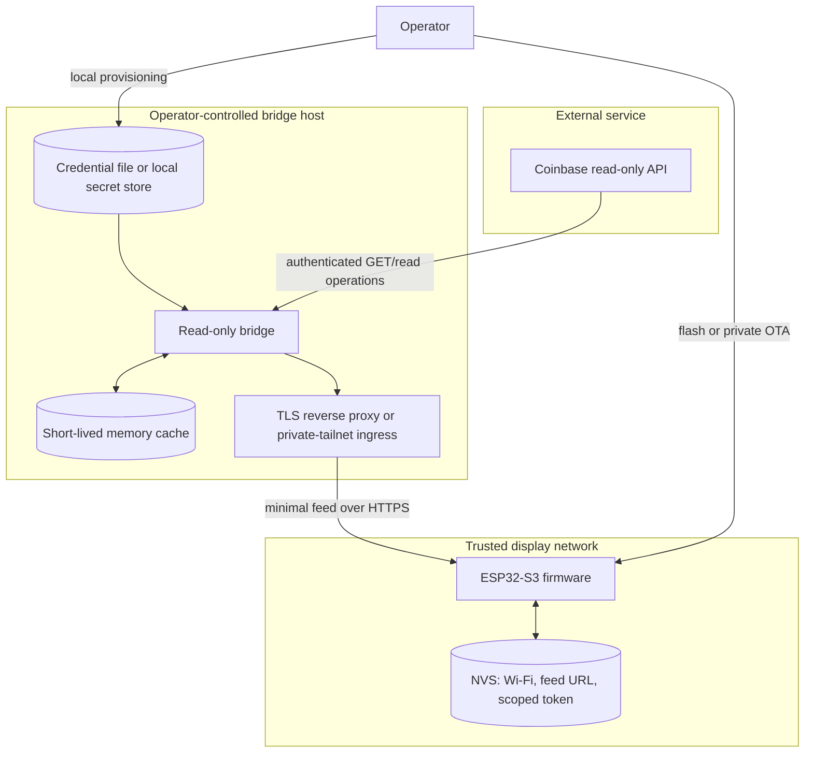
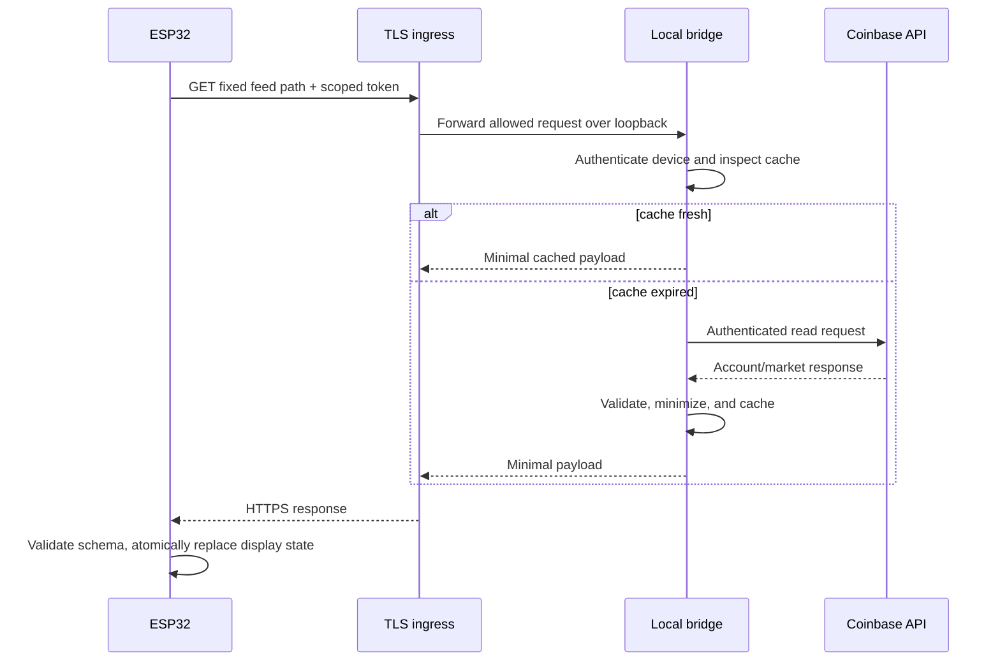

# Architecture

## Goals

Coinbase AMOLED Terminal provides a glanceable, read-only display while keeping
financial credentials and high-detail account responses off the embedded device.
The design optimizes for:

- local ownership and operation;
- a small, auditable network surface;
- explicit separation between Coinbase credentials and device authentication;
- bounded, cacheable read traffic;
- fail-closed behavior for authentication and schema errors; and
- support for two electrically different display-board revisions.

Trading, transfers, withdrawals, hosted custody, and autonomous financial actions
are outside the architecture.

## System context



## Components

### Local bridge

The bridge is the only component permitted to access the Coinbase credential. It:

1. performs read-only API requests;
2. validates and normalizes upstream data;
3. reduces it to the fields required by the display;
4. caches results briefly to bound upstream traffic;
5. authenticates each display using a separate feed token; and
6. exposes health and minimal device-feed routes.

The bridge must not expose a generic Coinbase proxy. A route that accepts an
arbitrary upstream path, method, body, product, or account identifier would break
the security boundary even if its current caller uses only reads.

### Reverse proxy or private-tailnet ingress

The bridge process binds to loopback by default. Cross-host access should be
provided by one of:

- an HTTPS service reachable only within a private tailnet; or
- a tightly configured TLS reverse proxy with firewall and authentication policy.

The ingress layer terminates TLS, limits methods and paths, rate-limits requests,
and avoids logging authorization headers or response bodies. Public anonymous
exposure is not a supported deployment.

### ESP32 firmware

The firmware:

- stores only Wi-Fi configuration, a feed URL, a device identifier, and a scoped
  feed token;
- polls the fixed read-only feed route;
- validates HTTP status, size, schema version, types, and numeric bounds;
- renders last-known-good data with clear stale/offline states; and
- selects V1 or V2 hardware support at build time.

It never receives a Coinbase API key and has no code path for order or transfer
operations.

## Trust boundaries

| Boundary | Trusted side | Untrusted or less-trusted side | Required control |
| --- | --- | --- | --- |
| Coinbase API ↔ bridge | Bridge credential process | Internet and upstream responses | TLS verification, strict parsing, read-only scope |
| Secret storage ↔ bridge | Owner-readable local storage | Other host users and container layers | File permissions, read-only mount, no image copy |
| Bridge ↔ ingress | Loopback service | Proxy configuration and host network | Loopback bind, method/path allowlist |
| Ingress ↔ ESP | Private network endpoints | Network observers and lost devices | HTTPS, scoped token, ACL, rotation |
| Firmware ↔ display hardware | Selected board variant | Incorrect revision or electrical assumptions | Explicit build selector, clean dual builds |
| Display ↔ nearby people | Operator | Anyone with visual or physical access | Minimal data, screen-off control, NVS erase |

## Feed contract

The exact schema is versioned with the implementation. Its design rules are:

- top-level `schema_version` is mandatory;
- timestamps use UTC RFC 3339 form;
- every collection has a strict maximum length;
- unknown fields are ignored only when the schema version is compatible;
- required fields with wrong types reject the entire update;
- numbers must be finite and within display-safe bounds;
- strings are length-limited and rendered as text, never as format strings; and
- the bridge omits raw upstream objects and identifiers not used by the UI.

Illustrative shape, with placeholders rather than account data:

```json
{
  "schema_version": 1,
  "generated_at": "<UTC timestamp>",
  "refresh_seconds": "<bounded integer>",
  "summary": {
    "display_total": "<formatted optional value>",
    "display_result": "<formatted optional value>"
  },
  "assets": [
    {
      "symbol": "<allowlisted symbol>",
      "display_price": "<formatted value>",
      "position": "<optional minimized position object>"
    }
  ]
}
```

Formatting monetary values on the bridge can reduce the number of raw precision
details sent to the display. If the firmware needs numbers for charts, those
fields still require finite-value and range validation.

## Authentication model

There are two unrelated credentials:

| Credential | Stored on | Purpose | Required scope |
| --- | --- | --- | --- |
| Coinbase credential | Bridge host only | Read selected account data | View/read only |
| Device-feed token | Bridge and one ESP | Read the minimized feed | One route, one device, rotatable |

A feed token must never be accepted by Coinbase-facing code as an API credential.
Likewise, the bridge must never send its Coinbase credential in a device response.
Comparisons should be constant-time where practical, and authentication failures
should return a generic response without revealing whether a device identifier or
token was wrong.

## Request sequence



## Failure behavior

- **Coinbase unavailable:** serve a clearly timestamped last-known-good cache only
  within a configured maximum age; otherwise return unavailable.
- **Bridge unavailable:** keep the previous frame and show stale/offline state.
- **Authentication failure:** do not serve cached portfolio data.
- **Malformed payload:** reject the complete update; never partially overwrite
  display state.
- **Clock or certificate failure:** fail TLS validation and surface a connection
  error rather than downgrading to insecure transport.
- **Wrong board variant:** stop and reflash the correct image; do not probe by
  issuing writes to both panel/PMU families.

## Deployment profiles

### Same-host development

Compose publishes the bridge on loopback. A local mock client can test it, but a
separate ESP cannot reach loopback directly.

### Trusted LAN

Keep the bridge on loopback and use an HTTPS reverse proxy bound to the LAN
interface. Restrict the host firewall to the display network. This is acceptable
only when the network is actively administered and the certificate is validated
by the ESP.

### Private tailnet (recommended for remote access)

Publish HTTPS only inside a private tailnet and use ACLs to allow the display or a
dedicated subnet router to reach the feed route. Do not enable a public funnel or
anonymous internet route.

## Build architecture

The firmware source is shared, but hardware-specific code is selected explicitly:

- `v1`: SH8601 display and FT5x06-family touch path, including required V1 power
  sequencing;
- `v2`: CO5300 display and CST816S/CST820-family touch path, avoiding V1-only PMU
  writes.

CI builds both variants from clean state with placeholder provisioning. Release
images are built locally with intentionally supplied per-device values and then
scanned before publication. CI placeholder artifacts are never production images.

## Design decisions

### Why a bridge instead of direct Coinbase access?

An ESP is easier to lose, inspect, or extract than a maintained host. A bridge
keeps the high-value credential in a more controllable environment, narrows the
device protocol, centralizes rate limiting, and allows credential rotation without
replacing a Coinbase key in firmware.

### Why no trading endpoints?

Read-only display code does not need them. Adding them would radically increase
credential value, threat impact, testing burden, and regulatory/operational risk.
They are a permanent non-goal rather than a disabled feature flag.

### Why explicit board selection?

The revisions use different panel and touch controllers, and unsafe exploratory
writes can blank or destabilize a board. An explicit compile-time selector is
easier to audit than runtime guessing based on unique device information.
