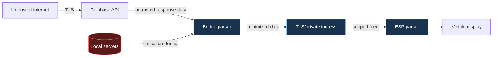

# Threat Model

## Scope

This model covers the repository's local bridge, TLS/private-network ingress,
device-feed protocol, ESP32 firmware, build/release process, and display hardware.
It assumes the Coinbase integration is configured for read-only access.

Trading, transfers, withdrawals, a project-operated cloud service, and physical
tamper resistance are outside the supported design. If a fork adds any of those,
this threat model is no longer sufficient.

## Security objectives

1. Coinbase credentials never leave the bridge host.
2. A compromised or lost display cannot authenticate directly to Coinbase.
3. A feed token grants only read access to one minimized device feed.
4. Unauthorized clients cannot retrieve portfolio data.
5. Network and upstream failures cannot silently present old data as current.
6. Untrusted payloads cannot corrupt memory or execute code on the bridge or ESP.
7. Public source, CI logs, releases, and Git history contain no secrets or personal
   infrastructure.
8. V1 and V2 builds cannot accidentally apply unsafe initialization to the wrong
   hardware revision.
9. Automatic firmware updates cannot install an unauthenticated, cross-board,
   same/older, prerelease, truncated, or digest-mismatched application.
10. POWER standby cannot interrupt a V2 automatic OTA write or reuse BOOT for an
    unrelated power action.

## Assets

| Asset | Sensitivity | Consequence if compromised |
| --- | --- | --- |
| Coinbase API credential | Critical | Unauthorized account-data access within its scope |
| Device-feed token | High | Access to minimized financial display data |
| Portfolio/position payload | High | Financial privacy loss and targeting risk |
| Wi-Fi and network configuration | High | Local network exposure |
| Bridge host and secret storage | Critical | Credential theft and feed manipulation |
| Firmware update channel | High | Persistent malicious code on the display |
| Display integrity/freshness | Medium | Misleading decisions based on false or stale data |
| Public Git history and artifacts | High | Irreversible dissemination of embedded data |

## Actors

- A passive network observer on an untrusted segment.
- An active attacker able to intercept, replay, or alter network traffic.
- A remote client that discovers an exposed bridge route.
- Malware or another user on the bridge host.
- Someone with physical possession of the display.
- A malicious or compromised dependency, CI action, contributor, or artifact.
- An upstream service returning malformed, unexpected, or stale data.
- A well-intentioned contributor who accidentally publishes local configuration.

## Assumptions

- The operator keeps the bridge host patched and controls local administrator
  access.
- TLS certificate validation remains enabled end to end.
- The Coinbase credential is genuinely restricted to read/view operations.
- Device-feed tokens are random, unique, and rotatable.
- The operator correctly identifies the hardware revision before flashing.
- A display with physical compromise is treated as untrusted and deprovisioned.

## Data-flow boundaries

Every arrow carries untrusted input at the receiving component. TLS authenticates
transport peers; it does not make payload content safe.

## STRIDE analysis

| Threat | Example | Primary mitigations | Residual risk |
| --- | --- | --- | --- |
| Spoofing | Attacker presents a stolen feed token | Per-device random token, TLS, ACLs, rotation, generic auth errors | Extracted tokens work until revoked/expired |
| Tampering | MITM changes price or position data | HTTPS with certificate validation, strict schema, timestamps | Compromised bridge/proxy can still falsify data |
| Repudiation | Unauthorized access is hard to investigate | Minimal auth outcome and timing logs, synchronized host clock | Privacy-preserving logs limit forensic detail |
| Information disclosure | Public route, verbose logs, screenshot, or firmware exposes data | Loopback bind, private tailnet, redaction, scoped feed, public scan | Physical display and backups remain observable |
| Denial of service | Poll flood exhausts API or bridge | Cache, rate limits, bounded bodies, timeouts, backoff | Local display may become stale/offline |
| Elevation of privilege | Generic proxy turns feed route into arbitrary Coinbase access | Fixed read-only routes, method allowlist, no user-supplied upstream path/body | Bridge host compromise bypasses app controls |

## Detailed threats and controls

### Credential exfiltration

**Paths:** committed configuration, container layer, exception trace, process
environment, serial output, core dump, backup, or malicious dependency.

**Controls:**

- read credentials from owner-controlled files or a local secret store;
- mount secret files read-only at runtime, never `COPY` them into images;
- avoid passing high-value secrets as command-line arguments;
- redact headers and upstream payloads before logging;
- run custom public-safety and Gitleaks scans on every change;
- scan full Git history before public release; and
- rotate immediately after suspected disclosure.

**Residual risk:** a privileged local attacker or compromised bridge process can
read the credential. Host security remains part of the trusted computing base.

### Feed-token theft and replay

**Paths:** plaintext HTTP, device flash extraction, reverse-proxy logs, shell
history, screenshots, or a sold/lost board.

**Controls:** TLS, per-device tokens, bounded lifetime where supported, token hash
storage on the bridge, constant-time comparison, route/method scope, and rotation.

**Residual risk:** the ESP must possess a usable secret. Hardware-backed storage
and secure boot can raise extraction cost but are not assumed in the baseline.

### Overbroad Coinbase permission

**Path:** operator creates a credential with trading or transfer capability.

**Controls:** setup documentation requires view-only scope, startup checks reject
known write scopes when the provider exposes scope metadata, and the bridge contains
no order code or generic passthrough route.

**Residual risk:** provider permission UX and metadata can change. Operators must
verify restrictions in Coinbase and rotate uncertain credentials.

### Malformed or hostile upstream data

**Paths:** unexpected JSON types, oversized bodies, non-finite numbers, long
strings, duplicate fields, or schema drift.

**Controls:** response-size limits, strict timeouts, structured parsers, type and
range checks, collection caps, schema versioning, and atomic state replacement.

**Residual risk:** parser/library vulnerabilities remain possible; dependency and
CodeQL review reduce but do not eliminate them.

### Stale or misleading display

**Paths:** bridge outage, frozen cache, clock skew, replayed response, or upstream
delay.

**Controls:** bridge-generated timestamp, bounded cache age, monotonic freshness
tracking, prominent stale/offline state, and no automatic action based on display
data.

**Residual risk:** users can overlook stale indicators. This display is
informational and not an execution control.

### Unsafe firmware variant

**Path:** a V1 image is flashed to V2 or vice versa, causing incompatible
panel/touch/PMU behavior.

**Controls:** explicit variant names, separate artifacts, boot-time variant label,
dual CI builds, release manifest, hardware checklist, compile-time isolation of
V1 rail writes, and a narrow cross-variant PWRKEY IRQ write allowlist.

**Residual risk:** manual flashing can still select the wrong file. Physical board
identification remains an operator responsibility.

### Firmware update substitution or interruption

**Paths:** compromised release metadata, a substituted binary, downgrade,
cross-board image, truncated transfer, or POWER standby during an inactive-slot
write.

**Controls:** V2 pins an Ed25519 manifest key and requires production/control/V2
hardware evidence, a strictly newer stable semantic version, exact project and
`-v2` identity, signed size and SHA-256, complete ESP-IDF image validation,
dual-slot selection, and rollback. The automatic updater holds a standby gate
through metadata checks and image writing; POWER standby waits or stays awake.
Manual OTA remains physically armed and defers standby while its window is open.
V1 has no automatic updater.

**Residual risk:** baseline boards do not enable Secure Boot or flash encryption,
so physical possession can replace firmware. GitHub, CI, the signing key, and the
review process remain supply-chain trust anchors.

### Supply-chain compromise

**Paths:** dependency takeover, mutable CI action, compromised container base,
malicious pull request, or substituted release binary.

**Controls:** dependency lock/manifest review, Dependabot, CodeQL, least-privilege
workflow permissions, protected branches, pinned Ed25519 release-manifest
verification for V2 automatic OTA, checksums, signed tags/artifacts where
available, and clean-clone release builds.

**Residual risk:** external build services and package registries are trusted. A
fully reproducible toolchain is a future goal.

### Physical access and shoulder surfing

**Paths:** visible portfolio values, stolen board, flash extraction, or debug-port
access.

**Controls:** volatile privacy mode, POWER-only standby/wake, minimized payload,
unique device token, NVS erase before transfer, deprovisioning, and optional
flash-encryption/secure-boot guidance for advanced operators.

**Residual risk:** baseline development boards are not tamper resistant. Assume
physical possession can expose device configuration.

## Abuse cases intentionally blocked

- Sending an order-shaped payload to the feed route.
- Supplying an arbitrary Coinbase API URL through a query parameter.
- Using a device token against an administration or health endpoint to retrieve
  extra data.
- Downgrading from HTTPS to HTTP after certificate failure.
- Publishing a firmware image containing a production token.
- Enabling a public anonymous tunnel for convenience.

Tests and review should treat the appearance of any such behavior as a security
regression.

## Verification map

| Objective | Verification |
| --- | --- |
| No repository secrets/private infrastructure | `scripts/scan_public_safety.py`, Gitleaks, full-history release scan |
| No trading surface | Route inventory review and negative endpoint tests |
| Strict feed parsing | Unit tests with wrong types, sizes, ranges, and schema versions |
| Dual-board safety | Clean V1/V2 builds plus hardware smoke test |
| Minimal workflow privilege | Review explicit GitHub Actions `permissions` blocks |
| Dependency health | Dependabot, `pip-audit`, component manifest review |
| Release integrity | Pinned Ed25519 manifest verification, signed size/SHA-256/board/version checks, rollback, two-person review |
| Physical controls | Host threshold/allowlist tests plus real V1/V2 POWER/BOOT smoke tests |

## Review triggers

Update this threat model when any of the following changes:

- a new endpoint, upstream API, credential type, or network exposure;
- data retained on disk or sent to another service;
- authentication, OTA, TLS, or provisioning behavior;
- supported hardware or board auto-detection;
- CI/release tooling or artifact distribution; or
- the permanent no-trading boundary.
